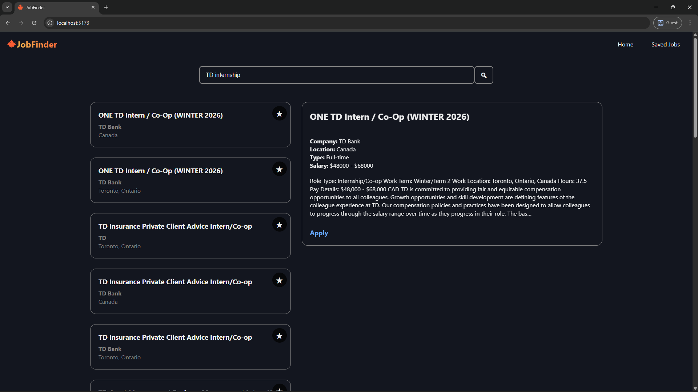
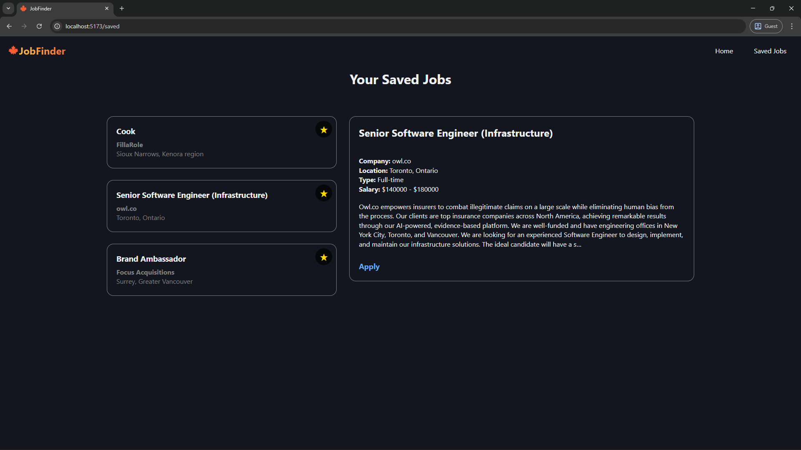
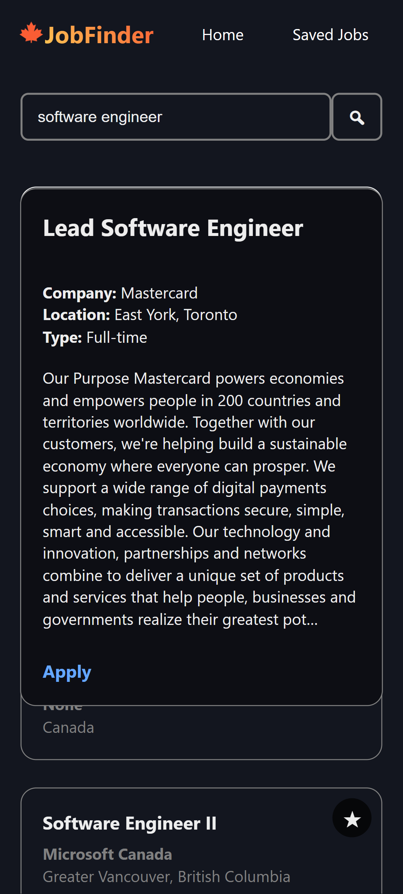

# JobFinder

A minimal and user-friendly React application for browsing and applying for jobs in Canada.

## Features

- **Job Search**: Browse real-time job listings in Canada
- **Save Jobs**: Bookmark job listings to review them later
- **Interactive Job Panels**: Click any job to view details and apply
- **Responsive Design**: Clean user interface on both desktop and mobile devices

## Tech Stack

- **Frontend**: React, React Router DOM
- **State Management**: React Context API + Local Storage
- **API Integration**: Adzuna API for job listings in Canada
- **Language**: JavaScript
- **Styling**: Custom CSS
- **Build Tool**: Vite

## Screenshots

<div>
  <h3>Desktop</h3>
  
  <br/><br/>
  
  
  <h3>Mobile</h3>
  
  <br/><br/>
  
</div>

## Installation & Setup

### Prerequisites
- Node.js (v14 or higher)

### Clone the repository
```bash
git clone https://github.com/czhengcs/JobFinder.git
cd JobFinder
```

### Install dependencies
```bash
npm install
```

### Set up environment variables
```bash
cp env.example .env
# Add your Adzuna API credentials to .env
```

### Run the application
```bash
npm run dev
```

## License
This project is licensed under the MIT License.